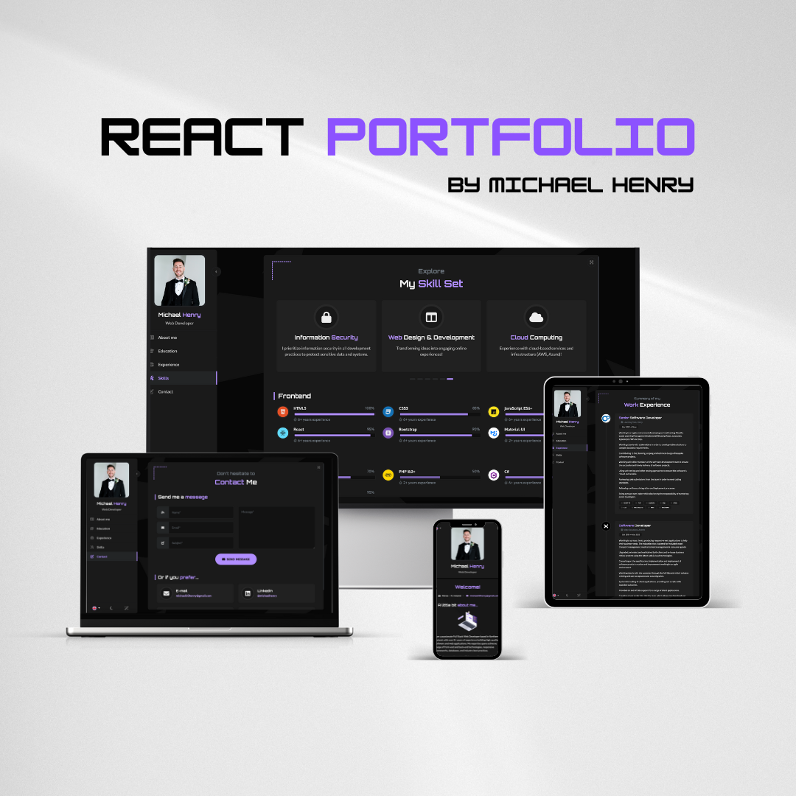

# [React Portfolio](https://michaelhenryni.github.io/portfolio/) By Michael Henry

A sleek, modern portfolio – built with **React** and **Bootstrap 5**.



Key features:

- Lightweight and fully responsive.
- Adapts perfectly to mobile screens.
- Multi-language support included.
- Comes with both dark and light theme options.
- A variety of components to highlight your work experience, education, skills, portfolio, and more.
- Uses **Vite** for packaging.
- Emails with **EmailJS** - no backend needed!

## [Live Preview](https://michaelhenryni.github.io/portfolio/)

Check out the live version of the template deployed **[here on GitHub Pages](https://michaelhenryni.github.io/portfolio/)**.

## Installation

1. Clone the repo:

```
git clone https://github.com/MichaelHenryNI/portfolio
```

2. Go to the root directory of the project and install all dependencies with npm:

```
npm install
```

3. Run the project in developer mode:

```
npm run dev
```

4. To temporarily deactivate the preload animation during theme adjustments, go to `public/data/settings.json` and modify the following field:

```
"preloader": {
    "enabled": false,
    (...)
},
```

It's based on the **[React](https://reactjs.org/)** framework created by Jordan Walke, and the **[Bootstrap](https://getbootstrap.com/)** framework created by Mark Otto and Jacob Thorton.

Additional frameworks and plugins used include:

- **Font Awesome**: A library of free vector icons.
- **Smooth Scrollbar**: A customizable scrollbar plugin.
- **Swiper**: A powerful library for creating touch sliders.
- **EmailJS**: A free service that allows you to send emails using JavaScript.
